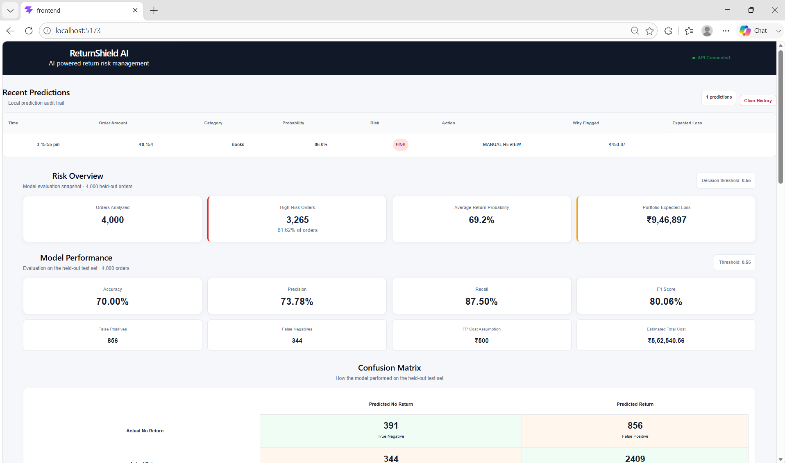

<div align="center">

# 🛡️ ReturnShield AI

### AI-Powered Return Risk Management for E-commerce

**Predict returns • Explain risk • Estimate financial loss • Prioritize merchant review**

<p>
  
</p>

[](https://www.python.org/)
[](https://fastapi.tiangolo.com/)
[](https://react.dev/)
[](https://vite.dev/)
[](https://scikit-learn.org/)

</div>

---

## 🚀 What is ReturnShield AI?

ReturnShield AI is a merchant-focused machine-learning application that predicts the probability of an e-commerce order being returned.

Instead of stopping at a prediction, ReturnShield converts the probability into an operational decision:

```text
Order
  ↓
ML Return-Risk Prediction
  ↓
Probability + Risk Factors
  ↓
Expected Financial Loss
  ↓
Merchant Action
  ├── LOW    → Normal Processing
  ├── MEDIUM → Verify Order
  └── HIGH   → Manual Review
  ↓
Audit Trail + Review Queue
```

### 🎯 The problem

Returns can quietly reduce e-commerce margins through reverse logistics, refunds, handling and other operational costs.

A merchant needs to know:

- Which orders are likely to be returned?
- Which orders deserve human attention?
- Why was an order flagged?
- What financial exposure does the order represent?
- How should the merchant prioritize limited review capacity?

**ReturnShield AI is designed around those decisions.**

---

## ✨ Key Features

| Feature | What it does |
|---|---|
| 🤖 **Return Risk Prediction** | Estimates probability of an order being returned |
| 🚦 **3-Level Risk Policy** | LOW / MEDIUM / HIGH operational classification |
| 🔍 **Risk Factors** | Explains rule-based factors associated with the prediction |
| 💰 **Expected Loss** | Estimates financial exposure using probability × return cost |
| 📋 **Merchant Review Queue** | Prioritizes MEDIUM and HIGH-risk cases |
| 📊 **Model Evaluation** | Precision, recall, F1, accuracy and confusion matrix |
| 🧾 **Audit Trail** | Stores recent prediction decisions |
| 📈 **Portfolio View** | Shows held-out evaluation and financial metrics |
| ⚡ **FastAPI API** | Provides prediction and analytics endpoints |
| 🖥️ **React Dashboard** | Provides a merchant-friendly interface |

---

## 🧠 Machine Learning

Two approaches were evaluated:

- Logistic Regression
- XGBoost

The deployed model is **scaled Logistic Regression**.

### Held-out test-set results

| Metric | Result |
|---|---:|
| Accuracy | **70.00%** |
| Precision | **73.78%** |
| Recall | **87.50%** |
| F1 Score | **80.06%** |

**Decision threshold:** `0.55`

### Confusion matrix

| | Predicted No Return | Predicted Return |
|---|---:|---:|
| **Actual No Return** | 391 | 856 |
| **Actual Return** | 344 | 2,409 |

This makes the trade-off visible instead of hiding false positives and false negatives.

---

## 💸 Cost-Sensitive Decision Making

ReturnShield does not optimize only for classification accuracy.

A false negative can represent a missed return and associated merchant cost, while a false positive can create unnecessary manual review.

For the final evaluation:

```text
False-positive cost assumption: ₹500
Decision threshold:              0.55

False positives:                 856
False negatives:                 344

Estimated total cost:            ₹5,52,540.56
```

Threshold sensitivity was also evaluated across multiple false-positive cost assumptions.

---

## 📊 Portfolio Evaluation

The held-out evaluation snapshot contains:

```text
Orders analyzed:             4,000
High-risk orders:            3,265
High-risk percentage:        81.62%
Average return probability:  69.18%
Portfolio expected loss:     ₹9,46,896.95
```

> ⚠️ **Important:** The dataset is synthetic and return-heavy. These figures are an evaluation/demo snapshot and should not be interpreted as real merchant traffic or production financial forecasts.

---

## 🔎 Risk Decision Layer

The ML model produces a probability. A separate business-policy layer converts that probability into an action.

```text
Probability < 30%
        ↓
LOW RISK
        ↓
NORMAL PROCESSING


30% ≤ Probability < 55%
        ↓
MEDIUM RISK
        ↓
VERIFY ORDER


Probability ≥ 55%
        ↓
HIGH RISK
        ↓
MANUAL REVIEW
```

This separation is intentional:

> **ML estimates risk; business policy determines the operational response.**

---

## 💰 Expected Loss

For an individual order:

```text
Expected Loss
=
Return Probability × Estimated Return Cost
```

Example:

```text
Return probability:       93.5%
Estimated return cost:    ₹569.95
Expected loss:            ≈ ₹532.69
```

This helps the merchant prioritize cases by potential financial impact.

---

## 🔍 Explainability

ReturnShield displays rule-based risk factors such as:

- High customer return rate
- Multiple previous refunds
- High discount percentage
- Low product rating
- Long delivery time
- Large quantity
- Fashion category has higher historical return rate

> These are **rule-based explanations**, not claims of causal feature importance from the Logistic Regression model.

---

## 🖥️ Dashboard

The dashboard combines the complete workflow:

### Risk Overview
- Orders analyzed
- High-risk orders
- Average return probability
- Portfolio expected loss

### Model Performance
- Accuracy
- Precision
- Recall
- F1 Score

### Confusion Matrix
- True positives
- True negatives
- False positives
- False negatives

### Merchant Review Queue
- HIGH-risk manual-review cases
- MEDIUM-risk verification cases
- Probability
- Expected loss
- Risk factors

### Financial Impact
- High-risk exposure
- Expected loss
- Review cases
- Average expected loss

### Recent Predictions
- Timestamp
- Order amount
- Category
- Probability
- Risk
- Action
- Expected loss

---

## 🏗️ Architecture

```text
┌───────────────────────────────┐
│        React Dashboard        │
│ Risk Overview / Queue / Audit │
└───────────────┬───────────────┘
                │ HTTP / JSON
                ▼
┌───────────────────────────────┐
│          FastAPI              │
│ /predict /dashboard /history  │
└───────────────┬───────────────┘
                │
                ▼
┌───────────────────────────────┐
│       ML Prediction Layer     │
│  Scaled Logistic Regression   │
└───────────────┬───────────────┘
                │
                ▼
       Return Probability
                │
        ┌───────┼────────┐
        ▼       ▼        ▼
       LOW    MEDIUM    HIGH
        │       │        │
      Normal  Verify   Review
                │        │
                └───┬────┘
                    ▼
            Expected Financial
                 Exposure
                    │
                    ▼
              Audit History
```

---

## 🧰 Tech Stack

### Machine Learning
- Python
- Pandas
- NumPy
- Scikit-learn
- XGBoost
- Joblib

### Backend
- FastAPI
- Uvicorn
- Pydantic

### Frontend
- React
- Vite
- JavaScript
- CSS

### Data
- Synthetic e-commerce return-risk dataset
- 20,000 generated orders
- 16,000 training rows
- 4,000 held-out test rows

---

---

## ⚡ Quick Start

### Option 1 — One click

Double-click:

```text
Start-ReturnShield.bat
```

It starts the backend and frontend and opens the dashboard.

### Option 2 — Manual

#### Backend

```powershell
cd C:\Users\ASUS\ReturnShield-AI
.\venv\Scripts\Activate.ps1
uvicorn api.main:app --reload
```

Backend:

```text
http://127.0.0.1:8000
```

API docs:

```text
http://127.0.0.1:8000/docs
```

#### Frontend

Open a second PowerShell:

```powershell
cd C:\Users\ASUS\ReturnShield-AI\frontend
npm run dev
```

Dashboard:

```text
http://localhost:5173/
```

---

## 🔌 API Endpoints

| Endpoint | Purpose |
|---|---|
| `GET /` | API status |
| `GET /health` | Health check |
| `POST /predict` | Predict return risk |
| `GET /dashboard` | Portfolio metrics |
| `GET /model-performance` | Model evaluation |
| `GET /confusion-matrix` | Confusion matrix |
| `GET /dataset-profile` | Dataset information |
| `GET /history` | Prediction audit trail |
| `DELETE /history` | Clear prediction history |
| `GET /review-queue` | Merchant review cases |
| `GET /financial-impact` | Financial impact metrics |

---

## 🧪 Example Prediction

```json
{
  "order_amount": 9013,
  "product_category": "Fashion",
  "discount_percentage": 40,
  "customer_order_count": 20,
  "customer_return_count": 8,
  "customer_return_rate": 0.4,
  "previous_refunds": 5,
  "delivery_days": 7,
  "product_rating": 2.8,
  "quantity": 3,
  "payment_method": "Credit Card",
  "customer_tenure_days": 500
}
```

Example response:

```json
{
  "return_probability": 0.935,
  "risk_level": "HIGH",
  "recommendation": "MANUAL_REVIEW",
  "estimated_return_cost": 570.65,
  "expected_loss": 533.69
}
```

---

## 🏆 Why this project matters

ReturnShield AI is designed around a practical merchant question:

> **“Which orders should I act on before a return becomes an expensive problem?”**

The project connects:

```text
Machine Learning
      +
Business Cost
      +
Explainability
      +
Merchant Workflow
      +
Auditability
```

That makes the system more than a classification model—it is a **decision-support prototype for return-risk management**.

---

## ⚠️ Limitations & Responsible Evaluation

This is a hackathon/prototype system.

Current limitations:

- The training/evaluation data is synthetic.
- The dataset has a return-heavy class distribution.
- Financial costs are assumptions for evaluation.
- Risk factors are rule-based.
- The model has not been validated on real merchant traffic.
- Production deployment would require calibration and monitoring.

Real deployment should use historical merchant data and periodically re-evaluate model performance, thresholds and cost assumptions.

---

## 🔮 Future Improvements

- Real merchant transaction data
- SHAP-based explanations
- Persistent database
- Merchant authentication
- Case assignment and review status
- Human feedback loop
- Model drift monitoring
- Probability calibration
- Dynamic threshold optimization
- Real-time alerts
- Return-prevention intervention experiments
- A/B testing
- Production cloud deployment

---

## 👨‍💻 Project Status

**Core prototype:** ✅ Complete

**ML evaluation:** ✅ Complete

**FastAPI backend:** ✅ Complete

**React dashboard:** ✅ Complete

**Merchant review queue:** ✅ Complete

**Financial impact analysis:** ✅ Complete

**Audit trail:** ✅ Complete

**Buildathon documentation:** 🚧 Final polish

---

<div align="center">

### 🛡️ ReturnShield AI

**From prediction → explanation → financial impact → merchant action**

Built as an AI Risk Manager prototype for e-commerce return-risk management.

</div>
